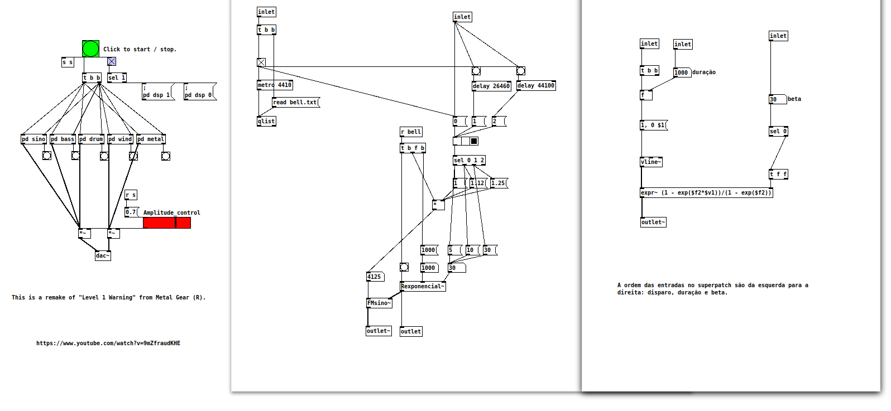

# Algorithmic Metal Gear (R) Music with Pd

Pure Data patch that algorithmically plays a sample music from the Metal Gear (R) game series, called "Level 1 Warning".

# Requirements

Only Pure Data is required, and on Linux it can be installed with:

```bash
	apt-get install puredata
```

# Usage

The file MAIN.pd contains the main patch. Click on the green bang to start / stop the song. Do not delete any patch nor text files inside the directory, as they are all used to do the synthesis of the instruments and play them with the correct frequencies at correct times.

# License

Please read the LICENSE file for rights and limitations.

# References

[1] F. R. Moore, "Elements of Computer Music". Prentice Hall, 1990.

[2] L. Kinsler, A. Frey, A. Coppens, and J. Sanders, "Fundamentals of Acoustics". Wiley, 2000.
