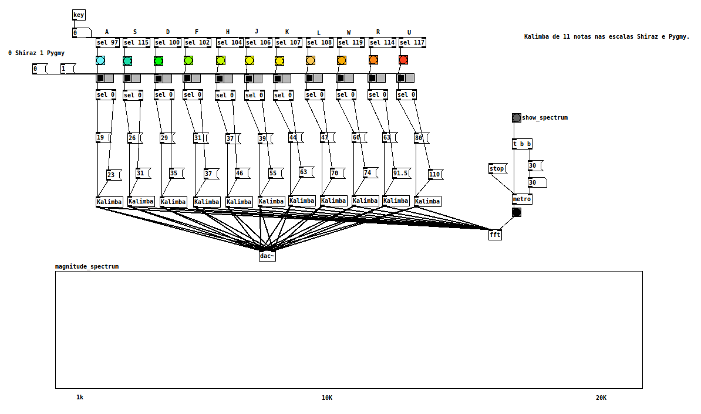

# Kalimba Patch in Pd

Pure Data patch that simulates a 11-key kalimba in the Shiraz and Pygmy scale, using sound synthesis techniques.

# Requirements

Only Pure Data is required, and on Linux it can be installed with:

```bash
	apt-get install puredata
```

# Usage

After turning DSP on, play it with keys A, S, D, F, H, J, K, L, W, R and U. If desired, the spectrum can be shown by clicking on the gray [bang].

# License

Please read the LICENSE file for rights and limitations.

# References

[1] F. R. Moore, "Elements of Computer Music". Prentice Hall, 1990.

[2] L. Kinsler, A. Frey, A. Coppens, and J. Sanders, "Fundamentals of Acoustics". Wiley, 2000.
